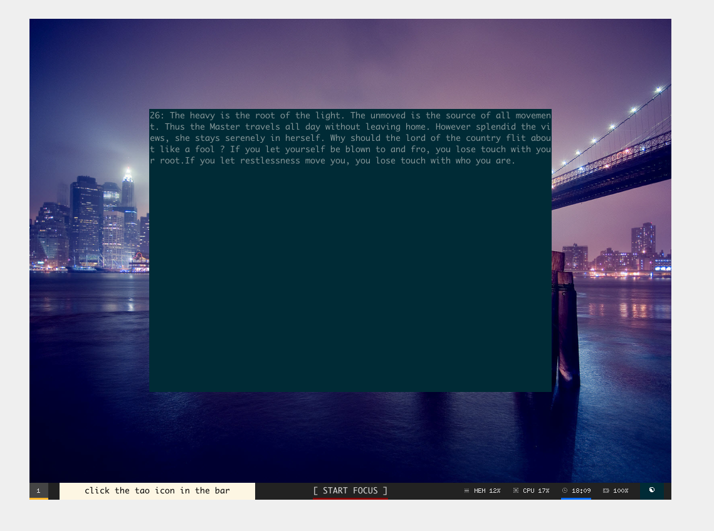

debian-rice
===



# Instructions

from debian ISO to desktop:

1. install debian from liveCD
    - Hostname x93
    - Username dt
    - LVM
    - no desktop environment selection (just ssh server and system utilities)

2. login at shell as root and run commands:

```
apt-get update
apt-get install git sudo
usermod -aG sudo dt
systemctl reboot
```

2. login as user dt and clone this repo, running install

```
git clone https://github.com/dt-rush/rice .rice
cd .rice
./install.sh
```

Alternatively, run sections of `install.sh` one at a time, inserting `exit` commands manually.

3. reboot and log in, x should start. Open a terminal and run `~/.rice/xinstall.sh` to install fonts
